# FLIGHT BOOKING WEBSITE

Phantom Airways is a flight booking website that make your travel planning seamless and hassle-free
it is a website where passengers can book there flight of any kind to any destination around Europe and South America.
Moreover, users of this website can discover the new adventures by searching for there flight trip through the home page, book there flight from the booking page, read about the company through the contact page and finally go to the help section if they need any question.
The site can be accessed through the [link](https://ebuka-martins.github.io/flight-booking-project/)

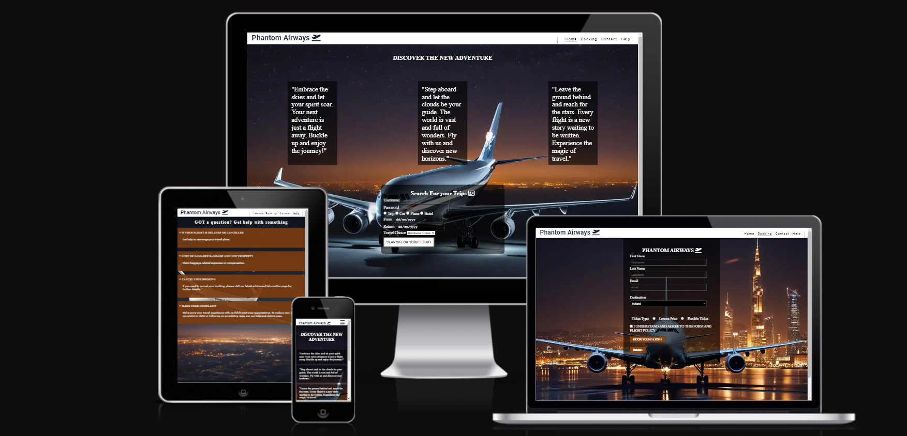

## Features

- __Navigation Bar_

  - featured on the top the navigation bar are all the four pages at the top right page of the flight booking website.
  - On the right top it shows links of Home, Booking, Contact and Help which links to different pages of the Web page.
  - The navigation bar of the flight booking website is in a Roboto font with links in normal font style and a color that contrast with the background. 
  - The navigation clearly tell the users the name of the website with informations easy to find in different sections on where to book for your trips and bookings.
  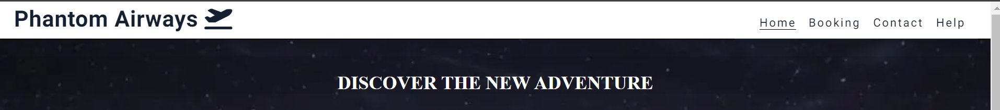

- __The Home Page Section_

  - The home section include the symbol and logo of the company.
  - It also shows a form on the home page which include a searching form where you can look for your trips and booking.
  - It provides the users with clear information of different choice icon of what you want to book.
  - It also tell the users where to input your username and password including what you want to book for?. 
  - This section also contain a button where you can search for your trip and also the date of departure and return.
  - This section can link you directly to the booking section where you can proceed with the booking choices.
  - This section introduces the user of different  type flight class you want to book.
  - This should also encourage users to consider booking there flgiht, car, plane and hotels.
  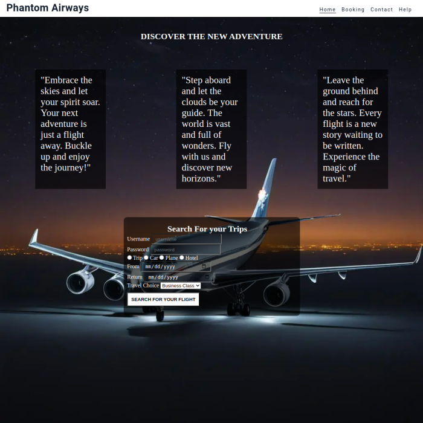

- __Forms and Buttons_
    
    - The forms and buttons on this project is where you can book for your trips.
    - The forms also enables users to choose the type of ticket they want to book.
    - The forms are user friendly to customers which enables them to always fill in there trip choices correctly before leaving the website.
    - The buttons gives the users the choice to reset the filling options if they chose to restart the booking application.
   
   - Home page forms
    
     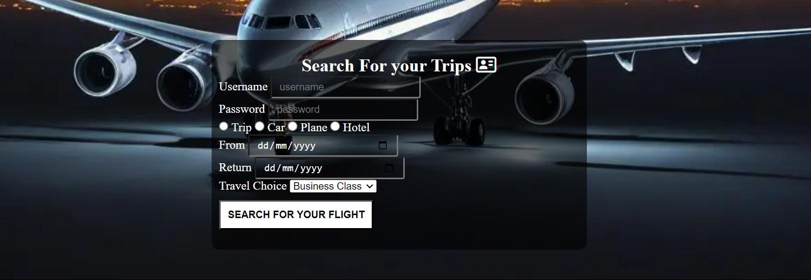

  - Booking page forms

    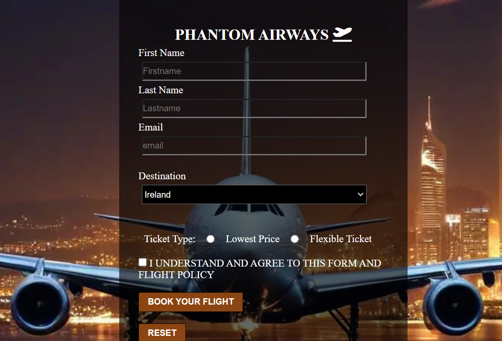

 - __The Footer_

   - The footer section contains social media icon links to enable the users find us on twitter X, facebook, youtube and instagram.
   - The footer is important to users because it gives them the ability to find us on social media for vital informations and updates.
   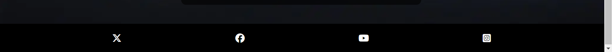

 - __The Booking Page Section_  

    - This section is where every users need to chose the destination and the type of ticket.
    - This section gives users the room to make choices of the booking of what they want which will directly leads you to a responsive page.
    
      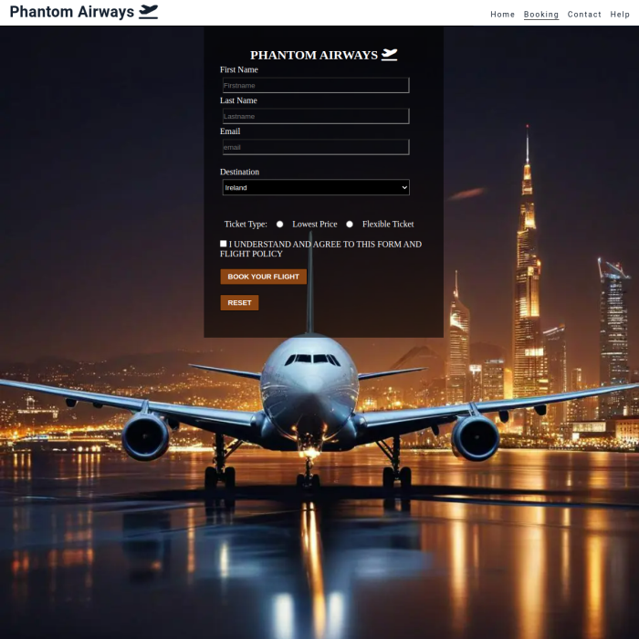

 - __The Contact Page Section_ 
   
   - This section gives the users a platform where they can search for the companies phone numbers, find contact information, and read a brief information about phantom airways.
   - The section contain the name, emails, phone number, and positions of the companies officials where the users can contact should they have a questions.
   - The section has a beautiful sky plane view background that gives the user that sensory experience.

    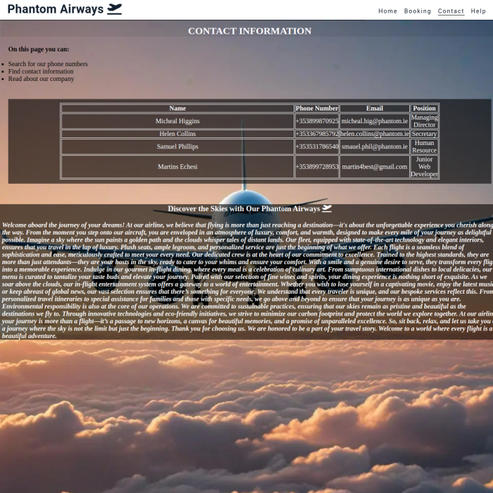

 - __The Help Page Section_ 

   - The page has a plane background view.
   - The section is a GOT A QUESTION PAGE where users can view for a quick answers to their question.
   - The section has a hovering tag where the users can click for their answers.
   - This section also gives the users an answers when their flight is been delayed or cancelled.
   - This section also gives the users an answers when their baggages is lost or damaged.
   - in this section, a user can find a quick answer to their question when their flight is cancelled.
   - The page section create an hovering icon where the users can file for a complaint.

  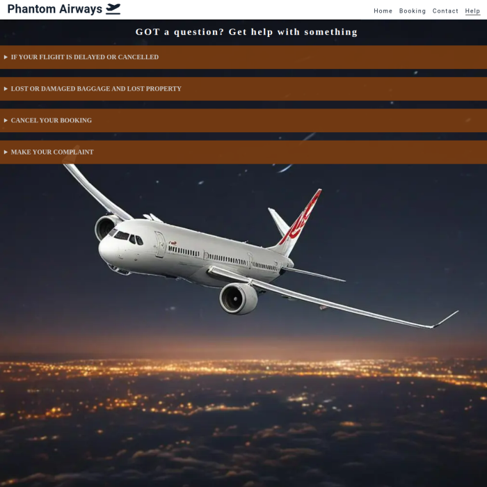

- __The Responsive Page Section_

  - The page tells the user that their trips, flight has been booked.
  - It is the feedback a user get after filling the order form to place a booking.
  - The responsive page background has a plane flying logo.
 
 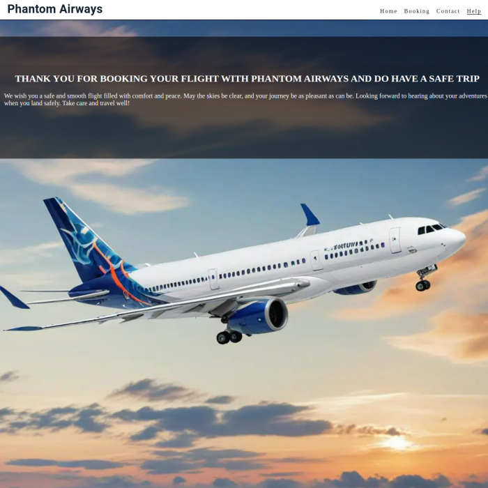

- __The 404 Error Page Section_

  - This section is an error page that emanate when a user type the wrong website.
  - The section is also user friendly to users, which means that it helps the user to always finds or return to the home page of the website.

 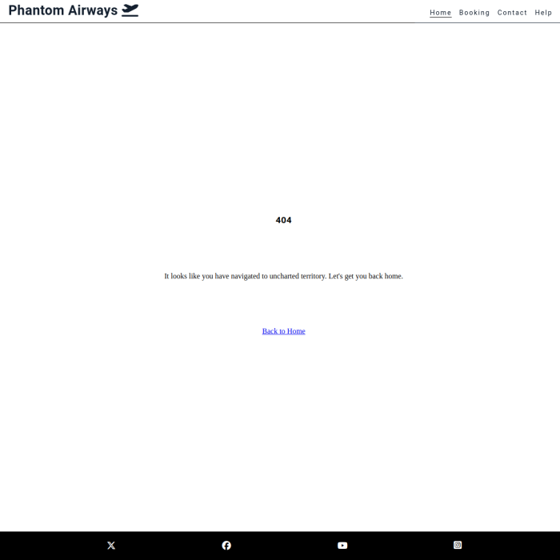 

## Design 

  ### Color Design

  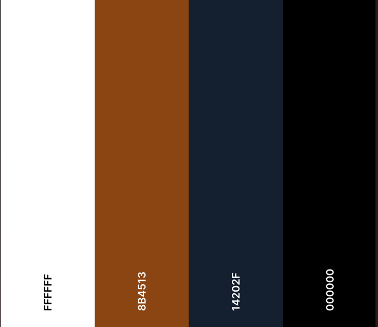 

  - White color was used as the font text of the website and the text on the button.
  - Transparent black color was used as the design background for forms, tables and hovering color that appears on the help page section when the you cursor.
  - Saddlebrown was used as the background color of the button and on the details section on the help page section.
  - Black color was also used as background color for footer and text color for content of header.
  - White color was also used as the background color for the header.
  - Saddlebrown is used as the hovering color that appears when you want to click on the table at the contact page table

  ### Typography 

  - Roboto google font was used as the main font of the website in order to increase readability of the content on the pages.

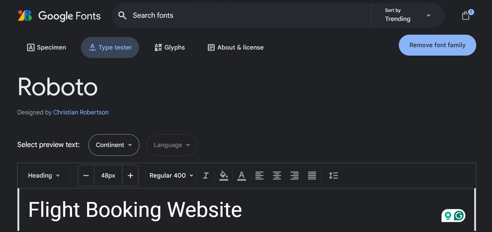 

# Testing
 
 ### Responsiveness 

  - In order to confirm the responsiveness across devices, the website was checked by devtools implemented in chrome browser, Microsoft Edge, and Firefox.  

 ### Compactability

  - In order to confirm the correct functionality and appearance across devices, the website was tested on the following browsers: Chrome, Firefox and Microsoft Edge.

## Manual Testing 

 | feature | action | expected result | tested | passed | comments |
| --- | --- | --- | --- | --- | --- |
| Navbar | | | | | |
| Home | Click on the "Home" link | The user is redirected to the main page section | Yes | Yes | - |
| Booking | Click on the "Booking" link | The user is redirected to the booking page section | Yes | Yes | - |
| Contact | Click on the "Contact" link | The user is redirected to the contact page section | Yes | Yes | - |
| Help | Click on the "Help" link | The user is redirected to the help page section | Yes | Yes | - |
| Main Page | | | | | |
| Home | Click on the "Home" link | The user is redirected to the booking page section immediately they fill out the form | Yes | Yes | - |
| Booking | Click on the "Booking" link | The user is redirected to the responsive page section immediately they have filled out the forms below, this shows they have booked for their flight | Yes | Yes | - |
| Contact | Click on the "Contact" link | The user is redirected to the contact page section where every contact is meant| Yes | Yes | - |
| Help | Click on the "Help" link | The user is redirected to the help page section where they can get a quick answers to their compaint | Yes | Yes | - |
| Footer | | | | | |
| Twitter x icon in the footer | Click on the Twitter x icon | The user is redirected to the Twitter x page | Yes | Yes | - |
| Facebook icon in the footer | Click on the Facebook icon | The user is redirected to the Facebook page | Yes | Yes | - |
| YouTube icon in the footer | Click on the YouTube icon | The user is redirected to the YouTube page | Yes | Yes | - |
| Instagram icon in the footer | Click on the Instagram icon | The user is redirected to the instagram page | Yes | Yes | - |
| Home page Section | | | | | |
| Username name input | Enter the username name | The username name is entered | Yes | Yes | If user doesn't enter the first name, the message saying you should fill out this field will appears |
| Password input | Enter the Password | The password is entered | Yes | Yes | If user doesn't enter the password, the message saying you should fill out this field will appears |
| input Label | Tick the radio | Tick radio is required | Yes | Yes | If user doesn't tick the radio, the message please select one of these options will appear |
| From and Return Dates | Click on the dates | The dates brings out the date of choice | Yes | Yes | These dates are required to enable the users decide the time of their choice|
| "Submit" button | Click on the "Submit" button | The user is redirected to the booking page section | Yes | Yes | - |
| Booking page Section| | | | | |
| First name input | Enter the first name | The first name is entered | Yes | Yes | If user doesn't enter the first name, the message saying you should fill out this field will appears appears |
| Last name input | Enter the last name | The last name is entered | Yes | Yes | If user doesn't enter the last name, the message saying you should fill out this field will appears |
| Email input | Enter the email | The email is entered | Yes | Yes | If user doesn't enter the email, the error message appears. which says you should fill out the required field |
| Destination input | Select the destination | Destination choice is entered | Yes | Yes | If user doesn't enter the destination, the error message appears. which says you should fill out the required field |
| input Label | Tick the Ticket type | Tick type is required | Yes | Yes | If user doesn't tick the radio, the message please select one of these options will appear |
| input Checkbox | Tick the Checkbox | Checkbox is required | Yes | Yes | If user doesn't tick the radio, the message please check this box if you want to proceed will appear |
| "Submit" button | Click on the "Submit" button | The user is redirected to the responsive page section | Yes | Yes | - |
| "Reset" button | Click on the "Reset" button | The user is allowed to refresh their booking application if they fill they have make a error | Yes | Yes | - |
| Help page Section| | | | | |
| Details and Summary | Click the Details | Click the summary box is required | Yes | Yes | If user clicked the summary the solution to the quastion will come up |

## Validation

+ ### HTML
  - Initially an errors was found at the label forms of both the home and booking pages, which was resolved accordingly by checking through for errors.
  
### Home page Section
 - No errors or warnings were found when passing through the official W3C validator.
 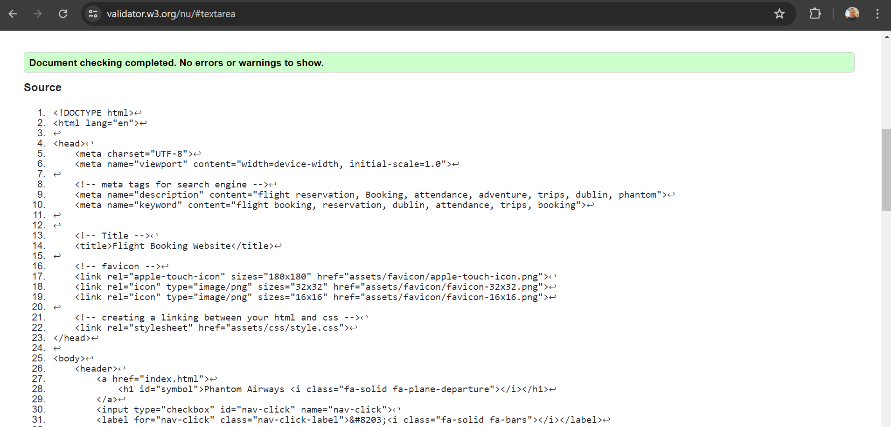

 ### Booking page Section
  - No errors or warnings were found when passing through the official W3C validator.
 

### Contact page Section
  - No errors or warnings were found when passing through the official W3C validator.
 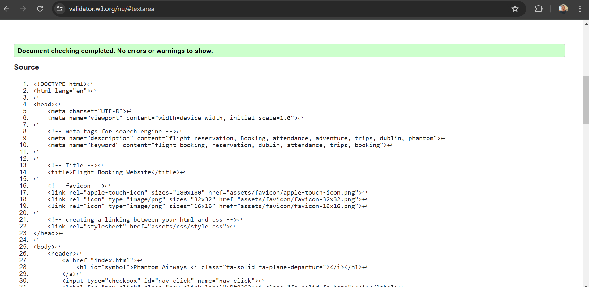
 
 ### Help page Section
  - No errors or warnings were found when passing through the official W3C validator.
 

 ### Response page Section
  - No errors or warnings were found when passing through the official W3C validator.
 

 ### 404 Error page Section
  - No errors or warnings were found when passing through the official W3C validator.
 

 ### CSS

  - No errors were returned when passing through the official W3C CSS Validator (Jigsaw).
  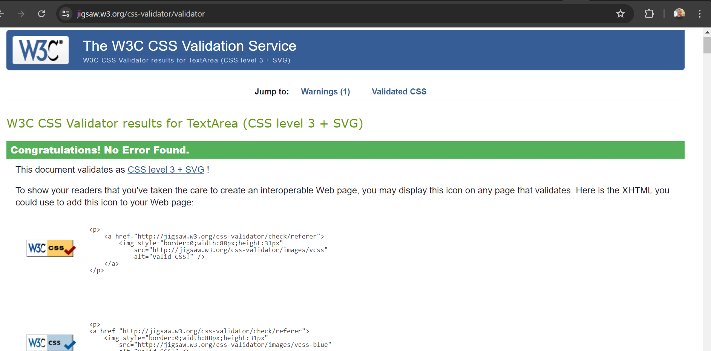

 ## Wave Test Report
  - wave test report was used to test the webpage performance and functions in different environments or at different times. 
  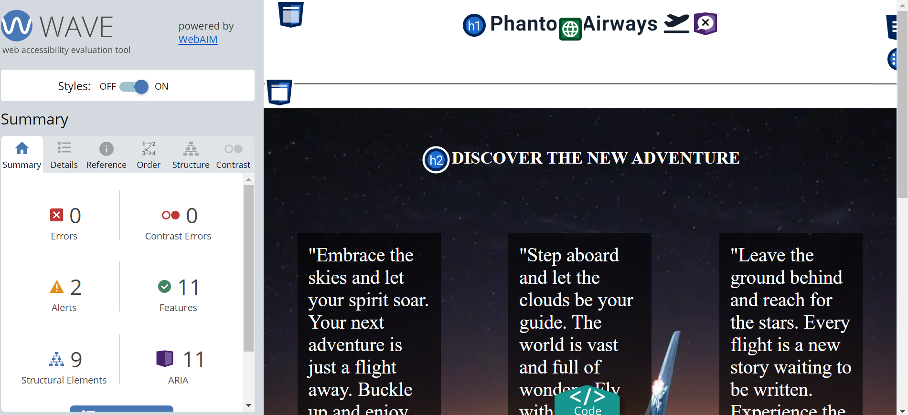

## Lighthouse test Report

  - Using lighthouse in devtools for my website, I confirmed that the website is performing well, accessible and colors and fonts chosen are readable.
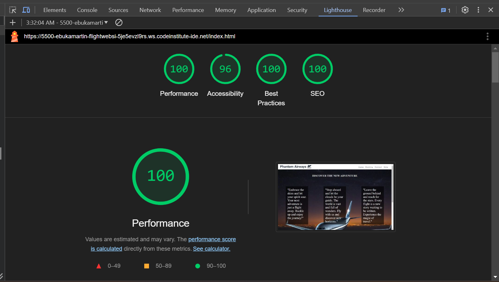

 